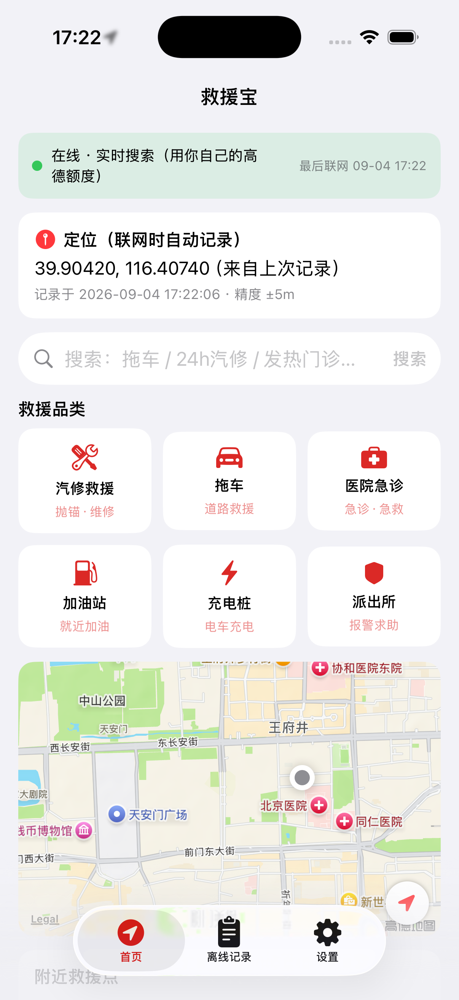
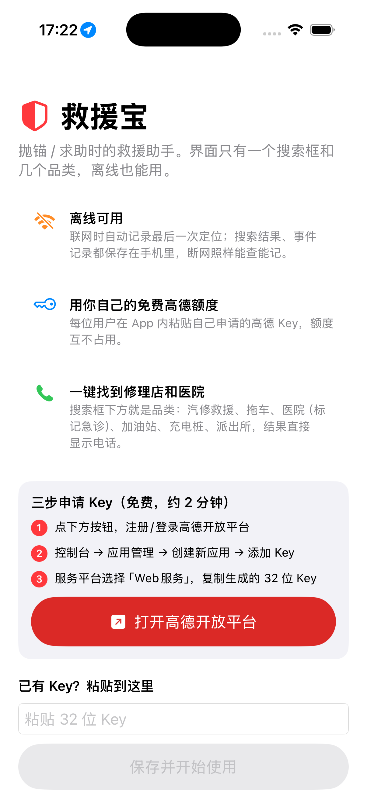
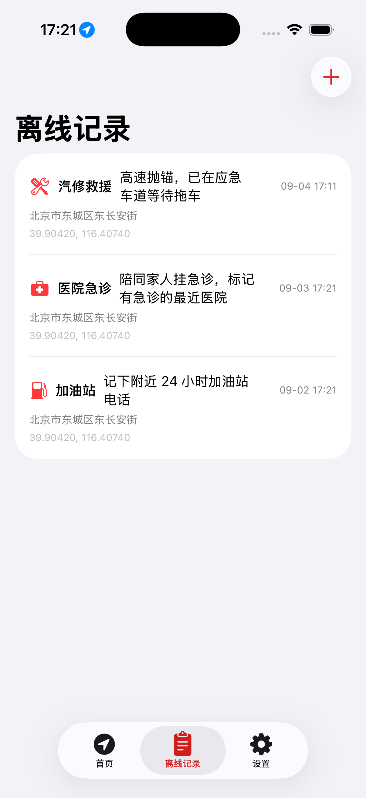
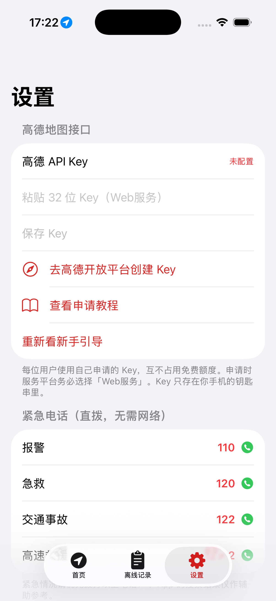

<div align="center">

# 救援宝 RescueMate

**一个离线友好的 iOS 救援助手 · An offline-first rescue assistant for iOS**

[](LICENSE)
[](https://developer.apple.com/ios/)
[](https://swift.org)
[](https://developer.apple.com/documentation/mapkit)
[](https://lbs.amap.com/)
[](https://github.com/JingHao-Leon/RescueMate/commits/main)
[](https://github.com/JingHao-Leon/RescueMate)

<table>
  <tr>
    <td></td>
    <td></td>
  </tr>
  <tr>
    <td></td>
    <td></td>
  </tr>
</table>

</div>

---

车抛锚、突发疾病、需要求助时，打开救援宝：**一个搜索框 + 六个品类**，快速找到最近的汽修厂、拖车、医院（标记是否有急诊）、加油站、充电桩和派出所，直接显示电话一键拨打。断网时依靠「最后联网定位 + 本地缓存 + 离线记录」继续工作。地图与搜索数据来自高德，每位用户在 App 内粘贴自己申请的免费 Key，互不占用额度。

## ✨ 功能亮点

| 功能 | 说明 |
|---|---|
| 🚨 六大救援品类 | 汽修救援（抛锚）/ 拖车 / 医院急诊 / 加油站 / 充电桩 / 派出所，搜索框下方一点即搜 |
| 📞 一键拨号与导航 | 结果直接显示电话（无电话自动补查详情），支持唤起高德 App 规划路线，没装则打开网页版 |
| 🏥 急诊标记 | 名字/类型含「急诊/急救」或「综合医院」的结果打上「急诊」标，突发疾病时优先看 |
| 📍 最后联网定位 | 联网时每次定位自动落盘；断网后 App 继续使用这条记录，首页展示坐标、地址、时间与精度 |
| 📴 离线可用 | 搜索结果按「品类 + 约 1km 格网」缓存，断网自动展示 8km 内最近缓存并标注时间 |
| 🗒 离线记录 | 记一笔自动附带最后定位，本地 JSON 存储，增删无需网络；紧急电话 110/120/122/12122 直拨 |
| 🗺 地图卡片 | 首页内嵌 MapKit 地图：用户位置 + 救援点图钉，点气泡拨号/导航，点列表行地图聚焦 |
| 🔑 Key 自带（BYOK） | 每位用户申请自己的高德「Web服务」Key 粘进 App（存钥匙串），用各自的免费额度 |

## 🔑 高德 API Key 接入（三种方式）

**方式一（默认）：每位用户自带 Key**。首启引导内嵌申请流程：[高德开放平台控制台](https://console.amap.com/dev/key/app) → 创建应用 → 添加 Key，服务平台选择 **「Web服务」**，复制 32 位 Key 粘进 App。Key 只存钥匙串，源码与仓库中没有任何真实 Key。

**方式二：运营方整包分发 Key**。构建时注入 `project.yml` 的 `AMAP_API_KEY`（或 xcconfig），读取优先级：用户钥匙串 Key > 随包 Key。

**方式三：服务器代理（已预留）**。Info.plist 配置 `SERVER_API_BASE` 即切换到 `ServerAMapClient`，Key 由服务端持有，约定接口见源码注释。

## 🛠 技术栈

- **Swift 5 + SwiftUI**，最低支持 **iOS 16**，无第三方依赖
- **高德 Web 服务 REST**：v5 周边搜索 / 详情 + v3 逆地理（`URLSession` + async/await）
- **MapKit** 地图卡（中国大陆底图数据源即高德，不需要 Key、不占接口额度）
- **CoreLocation** 持续定位 + 「最后联网定位」文件持久化
- **Network**（`NWPathMonitor`）联网状态监控；钥匙串存 Key；XcodeGen 管理工程

## 📁 项目结构

```
.
├── project.yml                    # XcodeGen 工程定义（Key 占位、权限声明）
├── RescueMate/
│   ├── App/                       # 入口、全局服务容器、TabView
│   ├── Models/                    # POI / 品类 / 事件记录 / 最后联网定位
│   ├── Services/
│   │   ├── AMapSearchClient.swift # 高德 REST 客户端 + 服务器代理预留
│   │   ├── APIKeyStore.swift      # 钥匙串存 Key、格式校验、申请入口
│   │   ├── LocationService.swift  # 定位 + 最后联网定位落盘
│   │   ├── NetworkMonitor.swift   # 在线/离线
│   │   ├── POICache.swift         # 搜索结果离线缓存
│   │   └── RecordStore.swift      # 离线事件记录
│   └── Views/                     # 首页 / 地图卡 / 结果行 / 记录 / 设置 / 引导
├── Tests/RescueMateTests/         # 9 个单元测试（解析/缓存/记录/排序/错误映射）
├── Scripts/make_icon.swift        # CoreGraphics 生成 App 图标
└── docs/screenshots/              # 运行截图
```

## 🚀 运行方法

```bash
brew install xcodegen     # 若未安装
git clone https://github.com/JingHao-Leon/RescueMate.git
cd RescueMate
xcodegen generate         # 生成 RescueMate.xcodeproj
open RescueMate.xcodeproj # Xcode 里 ⌘R 运行
```

命令行验证：

```bash
xcodebuild -project RescueMate.xcodeproj -scheme RescueMate \
  -destination 'platform=iOS Simulator,name=iPhone 17 Pro' build CODE_SIGNING_ALLOWED=NO

xcodebuild -project RescueMate.xcodeproj -scheme RescueMate \
  -destination 'platform=iOS Simulator,name=iPhone 17 Pro' test
```

> 模拟器上 `tel:` 拨号与高德 App 跳转无效果，需真机验证。

## 📴 离线设计

| 数据 | 位置 | 说明 |
|---|---|---|
| 最后联网定位 | Application Support/last_online_location.json | 联网时每次定位覆盖写入；离线沿用（GPS 本身不需要网络，地址解析才需要） |
| 附近搜索缓存 | Caches/poi_cache/品类_格网.json | 联网搜索成功即缓存；离线取 8km 内最近一份，标注「离线缓存 + 时间」 |
| 离线事件记录 | Documents/rescue_records.json | 手动记一笔或结果页「存记录」，自动附带最后定位 |

联网搜索失败（Key 无效 / 当日配额用完 / 服务类型选错）会给出中文原因并自动回退离线缓存。

## ⚠️ 局限

- 「急诊」为启发式标记（含"急诊/急救"或"综合医院"），高德接口没有直接的急诊字段，专科医院不标记
- 距离为坐标直线距离，仅供排序参考
- 个人 Key 有日调用量限制，超限后当日回退离线缓存，次日自动恢复
- 地图瓦片首次加载需要网络；未浏览过的区域离线不可见（标注数据来自本地缓存）

## 🗺 Roadmap

- [ ] 服务器代理模式落地（Key 由服务端持有，用户零配置）
- [ ] iCloud 同步离线记录
- [ ] 一键报警短信（含定位链接）
- [ ] 离线行政区划内置逆地理，彻底消除地址解析依赖

---

## English

**RescueMate (救援宝)** is an offline-first rescue assistant for iOS 16+, built with Swift 5 and SwiftUI. When your car breaks down or you need urgent help, one search box plus six category tiles (car repair, towing, hospital ER, gas station, EV charging, police) surface the nearest help with one-tap calling and AMap-app navigation.

Highlights:

- **Last-online location**: every fix captured while online is persisted locally and reused offline, with coordinate, address, timestamp and accuracy on the home screen
- **Offline-first**: POI results cached in ~1 km grids per category; when offline the nearest cached set (≤ 8 km) is shown with its fetch time; offline incident log needs no network at all
- **Bring-your-own-key (BYOK)**: each user pastes their own free AMap (Gaode) "Web service" REST key — stored in the Keychain — so quota is never shared; server-proxy mode is pre-wired behind the same protocol
- **Map card on MapKit**: in Chinese mainland the basemap is powered by AMap data — no extra key, no quota; pins support callout dial & navigation
- Emergency hotline dialing (110 / 120 / 122 / 12122) works with zero connectivity

See the Chinese sections above for architecture, offline storage layout and roadmap. The Xcode project is generated with XcodeGen (`xcodegen generate`).

## 📄 License

[MIT](LICENSE) © JingHao-Leon
